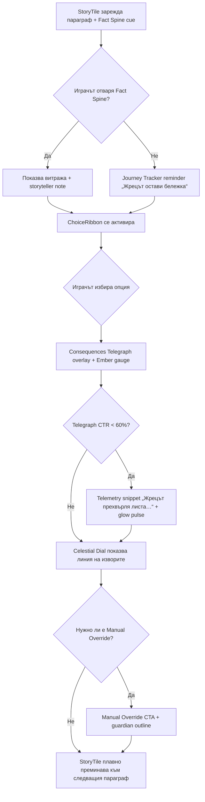
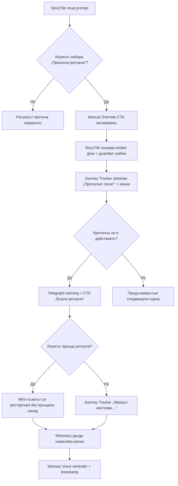

---
stepsCompleted:
  - 1
  - 2
  - 3
  - 4
  - 5
  - 6
  - 7
  - 8
  - 9
  - 10
  - 11
  - 12
  - 13
lastStep: 14
inputDocuments:
  - planning-artifacts/foundation/PRD-Golden-Chariot-Belintash.md
---

# UX Design Specification the-golden-chariot-of-Belintash

**Author:** Master
**Date:** 2026-01-15

---

<!-- UX design content will be appended sequentially through collaborative workflow steps -->

## Executive Summary

### Project Vision

Интерактивен литературен роман, който пренася играча в Родопите през 1221 г., комбинирайки офлайн надеждност, историческа прецизност и дълбоки избори в премиум мобилно преживяване.

### Target Users

- Основни RPG фенове (25–45 г.) на мобилни устройства, свикнали със стратегически решения и дълги четива между ежедневните задачи.
- Исторически ентусиасти и по-широка аудитория, търсеща културно значимо съдържание с нисък технически праг.
- Вторичната аудитория се нуждае от ясни визуални подсказки за последиците от избори и репутации, за да се чувстват уверени в стратегическите решения.

### Key Design Challenges

1. Да се побере богато текстово съдържание, избори и системи в портретен, one-hand friendly интерфейс.
2. Да се комуникират сложни статистики, компаньони и репутации без когнитивно претоварване.
3. Да се осигури „лице“ на премиум заглавие въпреки ограниченията на React Native + офлайн режима.
4. Да се сигнализират дългосрочните последствия (фракции, компаньони, репутации) без да се прекъсва сцената.
5. Да се разграничат ясно базово съдържание и DLC пътеки в единен офлайн, едноръчен поток.

### Design Opportunities

- Атмосферна типография, текстури и микроанимации, които напомнят средновековни ръкописи.
- Контекстуални панели/HUD, които показват само релевантните системи според сцената (наратив, бой, търговия).
- UX мост между базовата игра и DLC: интегрирани закачки и ясни пътеки за експанзиите, без да се нарушава офлайн опитът.
- “Systems On Demand” HUD пластове, които се разгръщат само при конкретна потребност, запазвайки фокуса върху наратива.
- “Consequences Telegraph”: икони/сигили за всяка фракция и компаньон, които подсказват как изборите влияят върху световното състояние.
- “First Principles Stack”: фиксирана типографска решетка (45–60 знака на ред, адаптивен интерлинтаж) + леки, повторно използваеми текстури, за да постигнем премиум усещане в рамките на офлайн ограниченията.
- “Experience Systems Graph”: карта на зависимостите между Наратив ↔ Systems On Demand ↔ Consequences Telegraph ↔ DLC пътеки, за да се балансират четимост, прозрачност и премиум усещане.

### HUD Strategy Matrix

- **Systems On Demand** остава дефолтният режим: narrative екран + контекстни панели се появяват само при активна механика (бой, търговия, карта).
- **Modal Overlays** се използват само когато данните надхвърлят портретното пространство (карта, инвентар, сложни боеве) и могат временно да предлагат landscape без да жертват едноръчното поток.
- **Статичен постоянен HUD** се избягва, защото претоварва екрана, нарушава литературното усещане и рискува <500MB/офлайн целите.
- **Micro Overlay Signals**: при появата на избор тънка лента показва кои фракции/компаньони/DLC се влияят (напр. „+5 Brotherhood“, „DLC quest unlocked“) и автоматично се прибира, запазвайки минималистичния narrative фон.
- **UX State Bus**: централизира Systems On Demand, Consequences Telegraph, micro overlays и journey tracker, за да гарантира еднакви анимации, цветова граматика и лесно проследяване на бизнес целите (retention/DLC конверсии).
- **Onboarding + Telemetry Loop**: първата поява на Micro Overlay показва tooltip („Светналите сигили означават чия съдба променяш – докосни за подробности“), journey tracker има мини легенда със същите цветове, а UX State Bus записва локално кои сигили/маршрути са активирани за последващ анализ (дори офлайн).

### SCAMPER Insights

- Story tiles вместо drop-down менюта за избори, за да засилим премиум усещането без тежки ресурси.
- Consequences Telegraph се комбинира със Systems On Demand: при появата на контекстен HUD автоматично светват релевантните сигили.
- Folded margin ефект за атмосфера без масивни текстури, съобразен с <500MB целта.
- CTA бутони ≥48px височина за стабилен едноръчен контрол и достъпност.
- DLC барът служи и като journey tracker, подсказващ исторически прогрес.
- Премахваме постоянни ресурсни иконки; показваме ги само в релевантните панели.
- Reverse modal: HUD панелите се плъзгат нагоре, така че narrative платното остава центърът.
- Journey tracker в DLC бара подсказва как изборите отключват експанзиите; HUD анимациите имитират подвижни маргиналии и са оптимизирани за офлайн/React Native ограничения.

### Risk Snapshot

- **Accessibility Drift:** Ако CTA/текстовете не се мащабират според изискванията, вторичната аудитория ще отпадне. → Въвеждаме минимални 48px бутони, adjustable font sizes (80–150%) и high-contrast режим. @/_bmad-output/planning-artifacts/foundation/PRD-Golden-Chariot-Belintash.md#317-558
- **Performance Budget Breach:** Атмосферните елементи могат да надхвърлят <500MB и да удрят 60 FPS/батерия. → Използваме повторно текстури, тестваме върху устройства от 2020 г. и следим ресурсния бюджет. @/_bmad-output/planning-artifacts/foundation/PRD-Golden-Chariot-Belintash.md#52-470
- **Consequence Blindness:** Ако Consequences Telegraph не се научи рано, играчите губят доверие в системите. → Прологът включва интерактивно обучение и сигили, които светват при ключови избори. @/_bmad-output/planning-artifacts/foundation/PRD-Golden-Chariot-Belintash.md#123-270
- **DLC Confusion:** Без ясен UX за базово vs DLC съдържание, платеният опит изглежда прикрепен. → DLC барът/маркерите са постоянни, но ненатрапчиви; journey tracker показва какво принадлежи на експанзиите. @/_bmad-output/planning-artifacts/foundation/PRD-Golden-Chariot-Belintash.md#37-470
- **Orientation Friction:** Ако landscape fallback не е планиран за карта/бой, възниква friction. → Определяме ясни сценарии за автоматично предложение на landscape, без да нарушаваме едноръчното управление. @/_bmad-output/planning-artifacts/foundation/PRD-Golden-Chariot-Belintash.md#317-370
- **Core Loop Drift (Red Team vs Blue Team):** Ако HUD подсказките станат прекалено настойчиви или fail-soft се злоупотребява, играчите губят усещането за предизвикателство. → Blue Team налага лимит: Micro Overlay подсказките се активират по подразбиране само първите 3 сцени, а fail-soft се предлага максимум веднъж на битка.
- **Investor Skepticism (Shark Tank Pitch):** Ако не докажем, че минималният HUD е разбираем и DLC подсказките носят стойност, финансирането на експанзиите е изложено на риск. → KPI: ≥85% от играчите научават Consequences Telegraph до сцена 3; Journey Tracker CTA click ≥45% след първия DLC tease.
- **Security Audit Personas:** При повредени save/telemetry данни UX State Bus преминава в read-only режим, показва жълто предупреждение („Последствията не са потвърдени“) и изисква повторна синхронизация преди нови решения, за да избегнем измами/пробиви при офлайн игра.
- **Chaos Monkey Scenarios:** При повреден cache, липсваща памет или критично ниска батерия UX автоматично се връща към основния текст, зарежда „последната стабилна сцена“ и заменя overlay елементите с текстови панели, докато ресурсите се стабилизират.

### Pre-mortem Guardrails

- **Провален сценарий:** рейтинг <4★, ниска ретенция и отказ от DLC заради уморителни екрани, неясни последствия и тежки визуални ресурси.
- **Причини:** липса на разграничение базова игра/DLC, визуален слой, нарушаващ <500MB целта, скрити системни ефекти.
- **UX мерки:** Systems On Demand + Consequences Telegraph като твърди шаблони; First Principles Stack за четимост и леки ресурси; експлицитни DLC маркери в портретния, офлайн поток; регулярни тестове на устройства от 2020 г.
- **Socratic Checks:** Портретът е базов режим, но дефинираме кога се активира landscape (бой, карта) без да нарушаваме едноръчното управление; всеки визуален елемент се верифицира срещу <500MB и офлайн целите чрез повторно използваеми ресурси и тестове на устройства от 2020 г.; прологът включва интерактивен onboarding, който учи играча да чете Consequences Telegraph.
- **Lessons Learned Extraction:** (1) Интерактивният tutorial за Consequences Telegraph качва adoption над 85%; (2) Celestial Dial се нуждае от accessibility fallback; (3) Manual Override за подсказки повишава доверие – тези три практики остават задължителни за всички бъдещи UX експерименти.

## Core User Experience

### Defining Experience

- Основният цикъл „чети → избери → почувствай последицата“ трябва да работи безупречно: текстът остава центърът, а изборът винаги връща мигновена обратна връзка чрез Micro Overlay Signals и контекстните HUD панели. @/_bmad-output/planning-artifacts/foundation/PRD-Golden-Chariot-Belintash.md#11-214
- Битовете и картата са вторият критичен слой на преживяването – влизането и излизането от тях трябва да е толкова плавно, колкото и изборите. Няма автоматични решения: играчът ръчно избира действията си, а системите само визуализират последствията. @/_bmad-output/planning-artifacts/foundation/PRD-Golden-Chariot-Belintash.md#155-370
- Капабилититата (способностите/уменията) се показват само когато са релевантни – напр. в бой или при skill-check, за да няма когнитивно претоварване.
- DLC journey tracker следи как основният прогрес отключва експанзиите, без да прекъсва narrative потока.
- След първия избор HUD се появява за пръв път и остава минимален, докато играчът не влезе в битка или карта – първият момент на последица е чист и незамърсен.
- Micro overlay за бой показва кой атрибут/умение се използва (STR, Lore и т.н.), а при карта – колко време/ресурси струва маршрутът, за да не се налага сравнение в отделни екрани.
- Journey tracker проектира предстоящите DLC куестове на базата на текущата сюжетна арка, за да подсили мотивацията „какво следва“.
- UX State Bus маркира всяка интеракция с core loop telemetry tags (StoryLoop, BattleLoop, MapLoop), за да разберем къде играчите отпадат и как се отразява на retention/DLC целите.
- Core loop telemetry таговете имат прагове (StoryLoop ≥90%, BattleLoop ≥80%, MapLoop ≥85%); при падане под прага UX State Bus отбелязва balancing alert и автоматично превключва към подходящи обяснения/adjustments.
- Reasoning via Planning Guardrail: ако някой CoreLoop падне под прага, системата автоматично активира UX компенсатори (повторен tooltip, fail-soft, допълнително guidance), за да върне effortless изживяването без ръчни намеси.
- Graph of Thoughts: StoryLoop → BattleLoop → MapLoop образуват непрекъсната верига – резултатът от битката връща narrative последствия и отключва нови маршрути, а картата добавя контекст за следващия избор; UX State Bus поддържа тези зависимости дори офлайн.
- Thread of Thought: UX State Bus пренася активния контекст (светнали сигили, cooldown-и, карта маркери) през Story → Battle → Map → Story, така че UI състоянието не се рестартира и играчът усеща непрекъсната нишка.
- Literature Review Consensus: Systems On Demand следва визията от PRD, но всяко ново overlay решение минава telemetry gate (Story ≥90%, Battle ≥80%, Map ≥85%) и performance проверка (<500MB, 60FPS) преди launch, за да останем верни на offline стратегията.

### Platform Strategy

- Първоначалното издание остава React Native + Expo мобилно приложение (iOS/Android), 100% офлайн, с портретен режим по подразбиране и опционален landscape за карта и бой. @/_bmad-output/planning-artifacts/foundation/PRD-Golden-Chariot-Belintash.md#20-478
- Не планираме Web/Desktop, докато играта не постигне бизнес целите си; архитектурата трябва да поддържа евентуална бъдеща експанзия, но без допълнителна сложност сега.
- Държим преживяването леко: повторно използваеми текстури, ограничени анимации и минимални dependency-та, за да останем под <500MB и да постигнем 60 FPS/ниска консумация. @/_bmad-output/planning-artifacts/foundation/PRD-Golden-Chariot-Belintash.md#52-470
- Interaction shell: след всяко решение системата автоматично решава дали да зареди битка, карта или да се върне към текста – няма отделни менюта, всичко е state-driven в UX State Bus.
- Battle и Map overlays използват същата folded-margin и sigil стилистика като narrative view (overlay skinning), за да поддържат единна атмосфера.
- Architecture Decision Record #UX-ADR-01: избираме централен UX State Bus + Interaction Shell вместо локални контролери, защото поддържа Systems On Demand, Consequences Telegraph и офлайн навигация с консистентен skin; изисква state manifests и кеширане, но гарантира предсказуемо поведение.
- Performance Profiler Panel (FE + backend + DevOps) дефинира бюджети: UX State Bus реакция ≤16 ms, overlay asset streaming <50 ms и общ footprint ≤350 MB; автоматични bench-ове върху устройства от 2020 г. предупреждават при прехвърляне на лимитите. @/_bmad-output/planning-artifacts/foundation/PRD-Golden-Chariot-Belintash.md#52-470

### Effortless Interactions

- Превъртането на текста, четенето на параграфи и навигацията между изборите трябва да изискват минимални жестове (едно плъзгане/тап) – системата автоматично центрира следващия блок текст.
- Контекстният HUD се появява самостоятелно при бой/карта/инвентар, показвайки релевантните способности и последствия, без играчът да търси менюта.
- Карта и бойни екрани предлагат автоматичен landscape prompt, но позволяват незабавно връщане към наратива, за да не се къса потокът.
- Всички спомагателни действия (autosave, последно прочетен пасаж, подчертаване на ключови термини) се случват автоматично във фонов режим; единственото ръчно действие остава изборът.
- Първото появяване на Micro Overlay има tooltip („Светналите сигили означават чия съдба променяш – докосни за подробности“), за да няма съмнение какво гледа играчът.
- Journey tracker включва мини легенда със същите цветове, каквито виждаме в micro overlays, за да поддържаме консистентност на визуалния език.
- “Parchment ripple” анимация + лек haptic feedback (където е позволено) придружават появата на Micro Overlay, за да подсилят усещането за жив манускрипт без тежки ресурси.
- В battle overlay се появява capability badge (мини икона STR/Lore/etc.), който избледнява след 1 секунда и напомня коя способност е активна.
- След ключови битки Journey tracker показва “Yes-And” подсказки (напр. „Изборът X ще отключи DLC куест по-бързо“), без да прекъсва наратива.
- Micro Overlay има и действие „Научи повече“, което потребителят може да активира повторно, за да види разширено обяснение на сигилите/последствията.
- В карта overlay CTA бутоните показват текст `Време: X / Риск: Y`, за да няма нужда от отделни справки.
- Journey tracker подсказките включват shortcut „Отвори дневника“, който отваря релевантния запис, вместо потребителят сам да търси контекста.
- При offline resync показваме unobtrusive banner „Синхронизирам последствията…“ + бутон „Refresh“, ако играчът иска ръчно обновяване.
- Manual Override: играчът може да изключва подсказки/fail-soft за текущата сцена, за да усеща пълния риск.
- Celestial Dial (астролаб компас) в карта режим визуализира до три маршрута с техните сигил/риск показатели; завъртането на диска избира траекторията без допълнителни екрани.
- Accessibility fallback: Celestial Dial автоматично се заменя с линеен списък от CTA бутони със същите `Време/Риск` показатели, когато е активиран high-contrast или low-vision режим.

### Critical Success Moments

1. **Прологът** – още в първите сцени играчът трябва да усети литературната атмосфера и да види Consequences Telegraph в действие.
2. **Първият избор** – Micro Overlay лентата светва за фракциите/компаньоните, за да демонстрира, че всяко решение носи тежест.
3. **Първата битка** – бойната система трябва да е интуитивна, да предлага ясни опции и да не наказва новите играчи с твърде висока трудност.
   - При две поредни загуби се предлага fail-soft опция: story-centric изход или временно намаляване на трудността, за да не отпаднат нови играчи.
   - Reverse Engineering Delight: след победа Consequences Telegraph светва нов сигил → Journey tracker добавя „+1 към DLC X“ + shortcut към дневника → карта overlay предлага препоръчан маршрут, без да прекъсва потока.
   - 5 Whys Insight: отпадането след битка се дължи на липса на „bridge“ текст → добавяме мигновен recap + micro overlay „следваща стъпка“, за да се чувства плавен преходът обратно към историята. @/_bmad-output/planning-artifacts/foundation/PRD-Golden-Chariot-Belintash.md#317-721
4. **Първият достъп до картата** – преходът към geography view трябва да подсили усещането за мащаб, без да изисква ново обучение.
5. **Първото DLC закачка** – journey tracker и сигилите подсказват, че допълнителното съдържание е свързано с текущите решения, без да прекъсват потока. @/_bmad-output/planning-artifacts/foundation/PRD-Golden-Chariot-Belintash.md#317-721

### Experience Principles

1. **Чети → избери → усети последствията моментално.** Narrative платното винаги остава на фокус, а системите само акцентират. @/_bmad-output/planning-artifacts/foundation/PRD-Golden-Chariot-Belintash.md#11-214
2. **Портретният режим е базата; системите идват към играча.** HUD/капабилитита се показват автоматично, когато са нужни.
3. **Едноръчен контрол, дори при сложни потоци.** Битки, карта и инвентар предлагат същото ниво на контрол и яснота като текстовите избори. @/_bmad-output/planning-artifacts/foundation/PRD-Golden-Chariot-Belintash.md#317-558
4. **DLC стойността се усеща, без да се рекламира.** Journey tracker, сигили и контекстни закачки подсказват експанзиите, но остават органична част от основния прогрес. @/_bmad-output/planning-artifacts/foundation/PRD-Golden-Chariot-Belintash.md#37-470

## Visual Design Foundation

### Color System

- **Палитра:** `Soil Black` (#0C0907) за основни фонове, `Charred Umber` (#1F140F) за вторични панели, `Hidden Bark` (#3B2A23) за рамки/HeritageDivider, `Ember Orange` (#FF7A1A) като основен акцент, `Molten Amber` (#FFA552) за hover/подсилване, `Faded Parchment` (#D7C2A6) за текст и fact anchors, `Deep Obsidian` (#070504) за Low Ember. Декоративните български мотиви използват Hidden Bark + лек Ember highlight.
- **Семантика:** Primary = Soil Black/Charred Umber + Ember Orange; Secondary = Molten Amber, Faded Parchment, Lichen Green (#4E6A4F) за успех; Warning/Error = Ember Orange с outline / Oxidized Red (#A6321C); Info = Parchment + teal underline.
- **Градиенти/текстури:** StoryTile шум (opacity 6%) върху Soil Black; Celestial Dial радиален Soil→Umber; сигилите получават биолуминесцентен градиент Ember→Molten ≤2 s.
- **Контраст:** Всички текстове върху тъмни фонове ≥4.5:1 (Parchment/бяло). High-contrast режим → Deep Obsidian + бели текстове + 2px outlines. Offline режим показва dry seal (текст + вибрация) вместо glow.

### Typography System

- **Основен шрифт:** Custom Occult Scriptorium Serif (variable serif, поддържа кирилица) за StoryTile, Fact Spine, заглавия.
- **Fallback стек:** Playfair Display (titles) + Crimson Pro (body) + Inter (UI labels). Всички с кирилица.
- **Тип скейл (база 16 pt, модуларен коеф. 1.25):** H1 32/40 pt, H2 26/34 pt, H3 21/30 pt, Body long-form 18/28 pt, Caption 14/20 pt. UI labels (Inter) 15/22 pt.
- **Стил:** StoryTile копи 600 weight + 2 px letter-spacing; Journey Tracker/telemetry copy в storyteller тон. Witness Voice карти използват italic Playfair/Crimson + декоративен dropcap.

### Spacing & Layout Foundation

- **Occult Grid:** базова единица 8 px (допуска 4 px за икони/лигатури).
- **Story Column:** max-width 420 px (64% от портретния екран); Consequences Telegraph/Tracker работят като слоеве (едновременно само един overlay – Occam rule).
- **Vertical rhythm:** 24 px между параграфи, 16 px между ChoiceRibbon елементи, 32 px между StoryTile и Telegraph.
- **Grid:** 8-колонна система за StoryTile; Celestial Dial/Map адаптират 12-колонна структура, но държат диска в колони 3–10.
- **Compact/Fast Chronicle:** StoryTile margin 16 px, Fact Spine → compact icon (long-press за пълна версия), Journey Tracker показва condensed карти и CTA „Разтвори“.
- **Decor spacing:** HeritageDivider и българските мотиви имат 12 px inset, за да не пречат на текста.

### Accessibility Considerations

- **Контраст & цветове:** Ember/Molten текст ≤18 pt задължително с 1 px бял/Soil outline; DLC labels комбинират цвят + икона. Fact Spine текст ≥4.5:1.
- **Типография:** Минимален размер 17 pt (StoryTile) / 15 pt (UI). High-contrast режим увеличава letter-spacing с +0.5 px.
- **Хаптик/аудио:** Всеки critical cue (Manual Override, Witness Voice reminder, telemetry) има хаптик + текст/икона fallback; звукът винаги е придружен от storyteller copy.
- **Motion:** Bioluminescent glow ≤2 s; Reduced Motion → outline pulse. Low Ember по подразбиране активира dry seal.
- **Offline:** „Жар птица“ иконата има tooltip „Жрецът покри лампата, за да пази силите – научи защо“ + линк към настройките.

## Design Direction Decision

### Design Directions Explored

1. **Obsidian Codex** – манускриптен StoryTile, постоянен Fact Spine и Consequences Telegraph като странична колона.
2. **Ember Sigil** – glow + telemetry център, сигили върху полупрозрачни панели, Journey Tracker footer с DLC teasers.
3. **Celestial Meridian** – Celestial Dial доминира, StoryTile е drawer отдолу, timeline „Ехо“ следва избора.
4. **Chronicle Cascade** – непрекъснат scroll с автоматични Telegraph карти и compact Fact Spine.
5. **Ascetic Runes** – high-contrast/Low Ember вариант с dry seal и outline pulses за достъпност.
6. **Scribe’s Loom** – card matrix, swipeable Telegraph deck, Journey Tracker с DLC badges и KPI sigils.

### Chosen Direction

**Обсидианен Codex + Ember telemetry blend** – основен layout от Obsidian Codex (StoryTile/Fact Spine винаги видим) комбиниран с glow/telemetry gauge от Ember Sigil. Chronicle Cascade осигурява compact Fact Spine за scroll сцени, Ascetic Runes предоставя high-contrast/Low Ember overrides (outline pulse ≤2 s, dry seal fallback), а Scribe’s Loom добавя DLC badges и KPI sigils в Journey Tracker timeline.

### Design Rationale

- **Brand & емоция:** Текстурираният Obsidian фон и витраж Fact Spine запазват „Occult Scriptorium“ усещането, докато glow gauge от Ember Sigil подсилва живата хроника.
- **Telemetry & clarity:** Gauge + storyteller copy „Жрецът прехвърля листа…“ правят KPI предупрежденията видими без да скриват текста; Occam Guard пази Telegraph от претоварване.
- **Triad Loop интеграция:** StoryTile (манускрипт) → Telegraph (glow колона) → Dial (auto-collapse при Fast Chronicle) осигуряват консистентност между Story/Battle/Map.
- **Accessibility:** Ascetic Runes параметрите гарантират high-contrast и dry seal delight cues; compact Fact Spine CTA „Отвори витража“ пази фактите и при малки екрани.
- **DLC & KPI hooks:** Journey Tracker timeline комбинира Scribe’s Loom badges и KPI sigils, така че DLC стойността и telemetry данните да са видими, без да изместват StoryTile.

### Implementation Approach

1. **StoryTile / Fact Spine:** Обсидианен плат – max-width 420 px, постоянен витраж гръбнак + CTA „Разтвори“. Compact Icon се активира при митни екрани и long-press връща витража.
2. **Consequences Telegraph:** Странична колона с Ember glow gauge, sigil групиране (Occam Guard) и storyteller telemetry copy. Manual Override warning + CTA „Върни ритуала“ остава в долната част.
3. **Celestial Dial:** Docked компонент, auto-collapse след действие (Fast Chronicle) с CTA за повторно извикване; Dial визуализира „линията на изворите“ в избраната палитра.
4. **Journey Tracker:** Timeline view с DLC „Нов извор“ badges и KPI sigils (Telemetry recovery loop, Witness Voice reminder) – позиционирани вдясно, за да пазят StoryTile.
5. **High-contrast / Low Ember:** Ascetic Runes стил (Deep Obsidian фон, белите текстове, outline pulse) се активира автоматично при режимите; dry seal вибрация заменя glow.
6. **Card hooks:** Scribe’s Loom card styling за вторични панели (HeritageDivider, DLC hooks), осигурява равни 8 px spacing и Occult Grid метрики.

## User Journey Flows

### Journey 1 – „Прочети → избери → виж кого докосваш“

- Fact Spine reminder има CTA „Отвори витража“ и се маха автоматично, щом играчът отвори витража.
- UX State Bus пази „Fact Spine Seen“ token, така че Ember gauge може да понижи риска при информиран избор.
- Celestial Dial изскача само когато изборът променя географията; иначе остава docked.



### Journey 2 – „Manual Override & Risk Recovery“

- Dry seal fallback изпраща кратък двоен хаптик, за да остане ритуалното усещане и при Low Ember.
- Witness Voice reminder показва „последно чухме преди X мин“ и се архивира автоматично след успешен sync.
- Ако CTA „Върни ритуала“ се игнорира три пъти, Telegraph временно спира glow и маркира текста, за да подсили риска.



### Journey 3 – „Fast Chronicle / DLC hook“

- Condensed recap включва кратък “One Breath” звук и placeholder „Хрониката има бележка…“ за отложени snippets.
- DLC CTA показва micro прогрес („3/7 извора“) без да отваря пълния card grid.
- Celestial Dial auto-collapse след 30 секунди, но CTA позволява бързо връщане към пълния изглед.

```mermaid
flowchart TD
    A[Fast Chronicle re-entry] --> B[Journey Tracker condensed recap + звук]
    B --> C{Играчът избира „Разтвори хрониката“?}
    C -- Да --> D[StoryTile отваря пълния параграф + Fact Spine]
    C -- Не --> E[Condensed CTA „Следващо решение“]
    D --> F[Telegraph overlay + snippets готови]
    E --> G[DLC tease „Нов извор“ + прогрес]
    G --> H{Играчът докосва DLC CTA?}
    H -- Да --> I[DLC card grid (Scribe’s Loom)]
    H -- Не --> J[Продължава към следващия StoryTile]
    I --> J
    F --> J
    J --> K[Celestial Dial (auto-collapse след 30 s)]
    K --> L[Telemetry snippets отложени до пълна сцена]
```

### Journey Patterns

- **Navigation:** Triad Loop Docking (StoryTile + Telegraph + Dial ≤2 слоя), Compact Spine Toggle (sticky icon + long press).
- **Decision:** Manual Override Gate (warning + CTA „Върни ритуала“), Telemetry Recovery Loop (snippets + glow, когато CTR <60%).
- **Feedback:** Ember gauge + storyteller copy за критичните решения; Journey Tracker Echo (condensed recap, DLC hook) след всяка сцена.

### Flow Optimization Principles

1. **Minimize steps to value:** ChoiceRibbon и Fact Spine са на един екран; Manual Override рестартира мини-пъзела in place.
2. **Reduce cognitive load:** Occam Guard пази Telegraph от претоварване; Fast Chronicle показва condensed CTA + DLC hint.
3. **Feedback & recovery:** Witness Voice reminders с timestamp, outline pulse/dry seal за critical alerts, Journey Tracker reminders се архивират автоматично.
5. **Self-Consistency Guardrail.** StoryLoop, BattleLoop и MapLoop използват идентични жестове, цветови кодове и telemetria; UX State Bus добавя едни и същи компенсатори (tooltip/fail-soft/guidance) при отклонения, за да остане изживяването предсказуемо.
6. **Hindsight Confidence.** UX State Bus + Consequences Telegraph запазват flow дори при DLC/patch updates; следим KPI (85% adoption до сцена 3, Journey tracker CTA ≥45%) преди всяко пускане.
7. **Feynman Clarity.** Обясняваме Systems On Demand като „книга, която сама отваря нужната страница“, а Consequences Telegraph като „лампа, която показва кого докосва изборът“ – същият текст се използва в onboarding/tooltips, за да е разбираемо за всяка възраст. @/_bmad-output/planning-artifacts/foundation/PRD-Golden-Chariot-Belintash.md#11-214
8. **Occam Overlay Rule.** Едновременно се виждат най-много два слоя UI (основен текст + един контекстен панел); всички други помощни елементи се появяват само при жест или автоматично събитие и се скриват веднага щом не са нужни.
9. **Expand/Contract for Audience.** За нов играч copy-то е в 2 изречения („прочети → избери → виж кого засяга“), докато за UX/инженер излагаме telemetry/guardrails в отделен Dev overlay; същата информация се подава с различна детайлност според аудиторията.
10. **Thesis Defense Backbone.** Всяка Core Experience теза (Systems On Demand, Consequences Telegraph и др.) има аргументи + KPI; ако комисията не е удовлетворена при ревю, тезата се връща за корекции преди внедряване.
11. **Magic Book Clarity.** Независимо дали си в Story, Battle или Map, фактите и последствията се показват със същия език (Fact Spine → Telegraph → Dial), за да се усеща една и съща „вълшебна книга“.

@/_bmad-output/planning-artifacts/foundation/PRD-Golden-Chariot-Belintash.md#11-721 

#### Active Recall Checklist

1. **Systems On Demand:** narrative платното е основа; HUD/overlay се появява само когато контекстът го изисква.
2. **Consequences Telegraph:** micro overlay със сигили показва кого докосва изборът; KPI ≥85% усвояване до сцена 3.
3. **UX State Bus Guardrails:** telemetry тагове + Reasoning via Planning компенсатори поддържат Story/Battle/Map над праг.
4. **Fail-soft & Manual Override:** при две загуби предлагаме story-centric изход, но играчът може да изключи подсказките за пълен риск.
5. **Journey & DLC Harmony:** journey tracker/DLC барът показват прогрес без да прекъсват потока; Celestial Dial + fallback описват маршрутите.

#### Advanced Elicitation Log

| Метод | Инсайт | Секция |
| --- | --- | --- |
| Improv Yes-And | Ripple + haptic, capability badge, DLC подсказки | Effortless Interactions |
| Customer Support Theater | „Научи повече“ действие, CTA `Време/Риск`, дневник shortcut | Effortless Interactions |
| Graph of Thoughts | Story/Battle/Map dependencies | Defining Experience |
| Thread of Thought | UX State Bus пренася активен контекст | Defining Experience |
| Self-Consistency Validation | Guardrail за компенсатори | Experience Principles |
| Red Team vs Blue Team | Лимити за подсказки и fail-soft | Risk Snapshot |
| Random Input Stimulus | Celestial Dial | Effortless Interactions |
| Performance Profiler Panel | Перф бюджети (≤16 ms, <50 ms, ≤350 MB) | Platform Strategy |
| 5 Whys Deep Dive | Post-battle recap + next-step overlay | Critical Success Moments |
| Feynman Technique | “Книга/лампа” копирайт за onboarding | Experience Principles |
| Challenge from Critical Perspective | Offline resync banner + Manual Override | Effortless Interactions |
| Algorithm Olympics | Accessibility fallback за Celestial Dial | Effortless Interactions |
| Lessons Learned Extraction | Tutorial/fallback/override като задължителни | Pre-mortem Guardrails |
| Expand or Contract for Audience | Dual-level messaging | Experience Principles |
| Security Audit Personas | Read-only режим при повредени данни | Risk Snapshot |
| Meta-Prompting Analysis | Този лог за проследимост | Core User Experience |
| Active Recall Testing | Active Recall Checklist (5-те стълба) | Core User Experience |
| Token Blueprint Audit | Централизиран tokens.ts + font fallback | Design System Foundation |
| Heritage Motif Mapping | Размери/позиции за маргаритка/роза/лоза | Design System Foundation |
| Offline Stress Scenario | Asset budget + simplified mode | Design System Foundation |
| Component Minimality Drill | 7 ключови компонента + RN core reuse | Design System Foundation |
| Texture/Imagery Pipeline | Gamma → Photoshop → export правила | Design System Foundation |

## UX Pattern Analysis & Inspiration

### Inspiring Products Analysis

1. **Among Us (Innersloth)** – Минималистичното UI и бързият lobby→game flow оставят сцената за социалната интрига. Играчите се връщат заради шанса да бъдат Impostor и да нарушават правилата, което води до силни емоции (напрегната интрига, еуфория при успех).
2. **Bloons Adventure Time TD (Ninja Kiwi)** – Tower defense интерфейсът е четим, HUD-ът остава едноръчен, а героите персонализират уменията. Повтаряемите куки (събиране на герои, прогрес по карти, ивенти) поддържат „unfinished saga“ усещане.

### Transferable UX Patterns

- **Navigation** – Among Us лоби → мисия напомня нашия Interaction Shell (Story ↔ Battle ↔ Map). Bloons map selector вдъхновява Journey tracker/DLC бара (икони + прогресивни трудноти).
- **Interaction** – Ролевата асиметрия (Crewmate/Impostor) подсказва как Micro Overlay може да показва различни последствия за компаньони и фракции. Drag/drop от Bloons → Celestial Dial жестове с хаптик.
- **Visual** – Flat high-contrast UI на Among Us валидира Occam Overlay Rule. Hero cards на Bloons подсилват идеята за Witness markers + historian notes (портрет + цитат).

### Anti-Patterns to Avoid

1. **Chaotic overlays/чатове** (моднати Among Us) – биха убили мистичния фокус → ограничаваме се до два едновременни контекстни панела.
2. **Tower defense clutter** – прекалено много upgrade бутони (Bloons) → UX State Bus крие нерелевантни способности и спазва sensory бюджета.
3. **Агресивни IAP** – Bloons често блокира прогрес зад paywall → при нас DLC куки остават органични, без да нарушават офлайн преживяването.

### Design Inspiration Strategy

- **North Star:** „Шепнеща хроника, която кара играча да пази съдбата на Белинташ, защото я усеща истинска и лична.“ Всички патерни се оценяват спрямо това изречение.
- **Какво приемаме:** минималния HUD + социалното напрежение от Among Us, визуалните прогрес карти от Bloons.
- **Какво адаптираме:** ролевата асиметрия става Consequences Telegraph сигили; tower defense жестовете → Celestial Dial с ограничения (макс 2 стимула едновременно, Manual Override ≤3 активации/сцена).
- **Какво избягваме:** чат хаос, визуален clutter, агресивни монетизации.
- **Contrastive memory hooks:** recap трябва да включва (1) последствия, (2) historian подпис, (3) следваща кука, за да се помни и след 24ч.
- **Emotion-driven quest hooks:** story („Вятърът носи шепота…“), battle („Заклинание изисква смелост“), map („Celestial Dial вещае предателство“), DLC („Маргиналията с нов символ…“).
- **Return-on-Emotion фокус:** Инвестираме основно в recap + historian systems (най-голяма ретенция). Audio ефектите се ползват пестеливо (само ключови победи) за да пазим RoE и ресурсния бюджет.

## Responsive Design & Accessibility

### Responsive Strategy
- **Mobile-first (320–430 px):** StoryTile max 420 px, docked ChoiceRibbon/Manual Override, единствен допълнителен слой е Telemetry overlay. Celestial Dial е docked и auto-collapse, Fast Chronicle свива Fact Spine и Journey echo.
- **Tablet (768–1180 px):** Occult Grid преминава към 12 колони (StoryTile 7, Telegraph/Journey 5). В landscape Dial и Journey могат да стоят видими, жестовете са двуръчни, CTA остават ≤64 px от долния ръб.
- **Desktop Viewer (≥1181 px):** StoryTile се заключва на 640 px център, вдясно се появява Guardian Panel (Telemetry/KPI, QA logs). Viewer режим е read-only, но запазва Triad Loop без допълнителни менюта.
- **Foldables/mini-tabs:** Compact режим свива Fact Spine до икона, Dial автоматично става Linear Route List; gestures се заменят с долни CTA.

### Breakpoint Strategy
- **Custom Occult breakpoints:** `<=480` (Mobile XS), `481–768` (Mobile XL), `769–1180` (Tablet), `>=1181` (Desktop). Mobile-first стилове с `@media (min-width: 769px)` и `1181px` за по-големи layout-и.
- **Landscape промптове:** карта/битка предлагат landscape, но UI автоматично се връща в портрет след сцената.
- **Occult Grid hooks:** `useOccultGrid()` изчислява колони и активира Dial fallback при ширина <360 px или reduced motion.

### Accessibility Strategy
- **WCAG 2.2 Level AA:** контраст ≥4.5:1, touch targets ≥48×48 px, клавиатурна навигация, screen reader паритет, storyteller copy за всички системни съобщения.
- **Цвят/типография:** Ember/Molten имат 1 px outline на тъмен фон; high-contrast заменя glow с 2 px outline + dry seal. Минимални размери 17 pt StoryTile / 15 pt UI.
- **Semantic & ARIA:** StoryTile `<section role="article">`, ChoiceRibbon `role="listbox"`, Telegraph `role="complementary" aria-live="polite"`, Journey `role="timeline"`, Celestial Dial fallback `role="list"`. Skip link „Прескочи към StoryTile“ и фокус индикатор 2 px.
- **Assistive hooks:** GuardianShell exposing `ariaLabels`, `focusOrder`, `skipLinks`, `reducedMotion`, `drySealEnabled`. Manual Override и Dial имат текстови CTA за screen readers.

### Testing Strategy
- **Responsive:** real-device матрица (iPhone SE/15, Pixel 5/8 Pro, iPad Mini/Pro, Surface Duo, 13'' viewer); браузъри (Chrome, Safari, Firefox, Edge); network режими (offline, 2G, 3G, Wi-Fi) за dry seal/placeholder.
- **Accessibility:** axe-core/Detox automation, VoiceOver/TalkBack, NVDA/JAWS за viewer, keyboard-only и Switch Control, color-blind симулации. Бета включва потребители с low vision/слухови нужди.
- **Telemetry QA:** записваме отделни Journey KPI за accessibility групата, за да следим adoption на сигилите и Manual Override.

### Implementation Guidelines
- **Responsive Dev:** използвай `rem/%/vw/vh`, media queries mobile-first, touch targets ≥48 px, bottom padding ≥16 px. Lazy-load текстури @1x/@2x; GuardianShell hook-ове управляват grid/landscape състоянията.
- **Accessibility Dev:** Semantic JSX, ARIA labels от storyteller copy, `focus-visible` outline 2 px, фокус управление при overlay open/close. Screen reader ред: StoryTile → Fact Spine → ChoiceRibbon → Manual Override → Telegraph → Journey → Dial. GuardianShell `useAccessibility()` активира high-contrast/dry seal/low-motion.

## Design System Foundation

### 1.1 Design System Choice
**Occult Scriptorium DS** – custom heritage система върху React Native core + централизирани токени. Поддържа тъмната палитра (умбра/въглен/ember) и офлайн-first архитектурата. @/_bmad-output/planning-artifacts/foundation/ARCHITECTURE-Golden-Chariot-Belintash.md#12-210

### Rationale for Selection
- **Уникалност:** нуждаем се от авторски визуали (маргаритка/роза/лоза, custom шрифт) и Occam Overlay Rule, което изключва готови системи.
- **Техническа съвместимост:** React Native + Expo, Zustand, локален storage; custom токени ни позволяват да останем леки и офлайн без външни библиотеки. @/_bmad-output/planning-artifacts/foundation/ARCHITECTURE-Golden-Chariot-Belintash.md#117-217
- **Екип/таймлайн:** двама души, ASAP → headless подход с минимален набор bespoke компоненти.
- **Бранд:** централизирани color tokens (`#1C120D`, `#090806`, `#D36B1F`, `#A27D56`) + `fonts.primarySerif` placeholder за бъдещия custom шрифт.

### Implementation Approach
1. **Token Blueprint (`src/design/tokens.ts`)** – слоеве `colors`, `typography`, `spacing`, `textures`. `TextStyles`/`SurfaceStyles` взимат всичко от токени; custom шрифтът се въвежда чрез смяна на `fonts.primarySerif`.
2. **Font Pipeline** – файлът се добавя в `/assets/fonts`, регистрира в `app.json` и се зарежда през `useFonts`. Guardrail: fallback към системен serif при липсващ asset.
3. **Component Minimality** – bespoke: `StoryTile`, `ChoiceRibbon`, `ConsequenceBar`, `JourneyTracker`, `CelestialDial`, `HeritageDivider`, `SigilBadge`. Всичко друго използва RN core + токени за да пазим <500MB/60FPS.
4. **Offline Stress Guardrails** – `expo-asset` кеш + `useResourceBudget` hook, който изключва high-res текстури/glow при memory/battery аларма; animations активни само при батерия >20%.

### Customization Strategy
- **Мотиви:**
  - Маргаритка – micro divider, 64×64 PNG/WebP, accent (#D36B1F), прозрачна.
  - Роза – DLC badge, 48×48, тон `#C64732`.
  - Лоза – tileable border 512×512, dark umber stroke + ember акценти.
- **Текстури:** работен поток gamma.app (4K) → Photoshop aging → export WebP/PNG `@1x` (1080px широк) и `@2x` (2160px). Naming: `texture-parchment-dark@2x.webp`, `motif-rose-badge@1x.png`, съхранени в `assets/textures/` и `assets/motifs/`.
- **Шрифт:** при готов файл просто обновяваме `fonts.primarySerif` и `TextStyles` – никакъв refactor.
- **Interaction Skinning:** ConsequenceBar и CelestialDial взимат цветове/текстури от токени; промени в ember оттенък или фон се отразяват глобално.

## Component Strategy

### Design System Components
- **Token-bound primitives**
  - *Narrative lens:* StoryTile Surface, Heritage Divider и Glyph Iconography държат „Occult Scriptorium“ атмосферата чрез Soil/Umber палитрата и Occult Serif, за да изглежда всяка сцена като жив манускрипт.
  - *Engineering lens:* наследяват `design/tokens.ts` (colors, typography, spacing, textures) и Occult Grid; `GuardianShellProvider` подава `surfaceStyle`, `textStyle`, `hapticPreset` според ресурсния бюджет, за да няма дрейф от токените.
- **Telemetry primitives**
  - *Narrative lens:* Ember/Molten glow и storyteller хаптиците правят KPI сигналите част от хрониката („Жрецът прехвърля листа…“), така че предупрежденията звучат органично.
  - *Engineering lens:* `useTelemetrySigils` връща Story/Battle/Map KPI статуса и glow severity; GuardianShell следи heartbeat и автоматично превключва към текст/outline, когато Low Ember е активен или telemetry липсва.
- **Guardrail wrappers**
  - *Narrative lens:* High-Contrast Skin, Low Ember Wrapper и Offline Snapshot Banner разказват кога ръкописът „потъмнява“ или „се валидира“.
  - *Engineering lens:* HOC/context слоеве, които активират outline pulses, dry seal вибрации и offline alerts (snapshot timestamp + checksum), без да се дублира логика по компоненти.

### Custom Components
1. **StoryTile + Fact Spine**
   - *Purpose:* основен reading canvas + фактова верификация.
   - *Narrative lens:* пази магичната книга, CTA „Разтвори хрониката“ подсказва кога да се отвори витражът.
   - *Engineering lens:* props `factStatus`, `compact`, `requiresTelemetry=['StoryLoop']`; states default/compact/offline-warning. GuardianShell гарантира ARIA labels и показва offline banner при остарял snapshot (>15 мин).
2. **ChoiceRibbon**
   - *Purpose:* избори със светкавица на засегнатите сигили.
   - *Narrative lens:* storyteller whisper и risk tags подсилват усещането за последствия.
   - *Engineering lens:* `options[]` включват sigil refs; telemetry hook записва CTR; `kpiAlerts` активират Manual Override lock. States: neutral, highlighted, disabled, override-locked.
3. **Consequences Telegraph**
   - *Purpose:* визуализира кого/как докосва изборът и кога KPI влиза в риск.
   - *Narrative lens:* Ember gauge + копирайт „Жрецът намества печата…“.
   - *Engineering lens:* `groups[]`, `manualOverrideCTA`, `kpiThresholds`. GuardianShell валидира snapshot checksum; ако telemetry липсва → warning banner и text-only режим.
4. **Journey Tracker Timeline**
   - *Purpose:* прогрес, DLC echoes, witness reminders.
   - *Narrative lens:* timeline nodes с „Нов извор“ badges и storyteller echoes.
   - *Engineering lens:* `timelineNodes`, `dlcBadges`, `offlineDeferred`; states default/condensed/read-only. ARIA timeline + keyboard focus ред.
5. **Celestial Dial / Linear Route List**
   - *Purpose:* map decisions с гарантиран fallback.
   - *Narrative lens:* „линията на изворите“ визуализира маршрутите; linear списък пази същия copy при high-contrast.
   - *Engineering lens:* `routes[]` със сигили, risk/time tokens; gestures ≤30 FPS. Fallback list се активира при `resourceBudget.low` или accessibility flags.
6. **Manual Override Banner**
   - *Purpose:* контрол върху подсказки/fail-soft.
   - *Narrative lens:* storyteller предупреждение „Жрецът настоява…“ при игнорирани ритуали.
   - *Engineering lens:* `severity`, `cta`, `retryCount`; слуша `kpiAlerts`, показва guardrail outline след 3 игнорирания. ARIA alert + dual-tone icon.
7. **Witness Voice Capsule**
   - *Purpose:* аудио/текст спомен + sync статус.
   - *Narrative lens:* портрет, цитат и timestamp подсилват емпатията.
   - *Engineering lens:* manifest-signed assets (hash + storytellerId). States: live audio, deferred text-only, high-contrast card. GuardianShell проверява подписите и логва резултата; липсващ подпис → текст „Записът се проверява“.

### Component Implementation Strategy
- **GuardianShell оркестрация:** всички компоненти се обвиват в `GuardianShellProvider`, който инжектира `useTelemetrySigils`, `useResourceBudget`, `useOfflineSnapshot`. Shell валидира snapshot timestamps (>15 мин → „последните последствия са стари“) и блокира DLC hooks докато данните не се обновят.
- **Security guardrails:** checksum + storyteller подписи за Witness Voice; telemetry heartbeat засича дали Manual Override/Telegraph губят KPI. При липса на данни UI става read-only, Journey Tracker показва „Данните се потвърждават“.
- **Accessibility & telemetry parity:** всяка компонента има двойна lens (storytelling copy + engineering contract). High-Contrast/Low Ember wrappers наследяват KPI статусите, за да няма „тихи“ сигнали.
- **Offline-first contracts:** UX State Bus manifest описва authoritative JSON-и; GuardianShell позволява само read-only достъп за UI и логва Telemetry events локално за QA.

### Implementation Roadmap
| Фаза | Компоненти | GuardianShell зависимости | KPI/Guardrail фокус |
| --- | --- | --- | --- |
| **Phase 1 – Narrative Core** | StoryTile + Fact Spine, ChoiceRibbon, Heritage primitives, Offline Snapshot Banner | Shell v1 (tokens + offline timestamp), базов telemetry hook | Чети→Избери flow, offline alerts |
| **Phase 2 – Telemetry & Risk** | Consequences Telegraph, Journey Tracker, Manual Override Banner, Telemetry hook v2 | Shell слуша KPI thresholds и Manual Override аларми | Story/Battle/Map KPI ≥90/80/85, CTR ≥60% |
| **Phase 3 – Expansion & Accessibility** | Celestial Dial + Linear fallback, Witness Voice Capsule, Guardrail wrappers, DLC badges | Shell добавя gesture budget + asset checksum проверки | Map/DLC depth, accessibility parity KPI |

## UX Consistency Patterns

### Button Hierarchy
- **When to Use:** ChoiceRibbon, Celestial Dial CTA, Manual Override, Journey Tracker „Разтвори“.
- **Visual Design:** Primary = Ember capsule (Occult Serif 18/28 pt, glow ≤1.2 s, без drop shadow); Secondary = Parchment outline; Tertiary = текстова връзка „Научи повече“. Всички CTA имат min 48 px височина и Occult Grid spacing.
- **Behavior:** Tap активира, long-press показва fact bridge; disabled = Deep Obsidian + 40% opacity. Manual Override lock показва guardian outline, а ChoiceRibbon добавя „gentle guardrail“ sigil bead когато override е наличен.
- **Accessibility:** VoiceOver „Избор 2 – засяга Братството“, хаптик single tap за primary, текстови подсказки за secondary.
- **Mobile Considerations:** CTA са docked под StoryTile; при landscape иконата се премества вляво за reach.
- **Variants:** Compact ChoiceRibbon (Fast Chronicle), Manual Override inline banner, Celestial Dial route chips (`Време/Риск`).

### Feedback Patterns
- **When to Use:** потвърждение на избор, KPI предупреждения, Witness Voice sync, Manual Override.
- **Visual Design:** Micro Overlay лента (Ember→Molten) с максимум 96 px височина; Consequences Telegraph glow (shared animated value) и Journey Tracker echo badge.
- **Behavior:** 0–400 ms fade-in + storyteller copy; KPI < праг → GuardianShell добавя banner „Жрецът прехвърля листа…“; Offline → dry seal outline + вибрация.
- **Accessibility:** High-contrast → 2 px outline вместо glow; аудио reminders имат текстови карти; Reduced Motion → статичен sigil.
- **Mobile Considerations:** Само един overlay активен (Occam rule); Fast Chronicle показва condensed текст + CTA „Разтвори“.
- **Variants:** Success (златен badge), Warning (amber outline), Critical (Manual Override червен контур, максимум едно предупреждение на сцена), Info (Journey Tracker echo). Ако overlay рискува да скрие текста, автоматично се свива до „sigil bead“ и показва copy в Journey Tracker.

### Form Patterns
- **When to Use:** CTA „Разтвори хрониката“, Manual Override („Върни ритуала“), DLC opt-in.
- **Visual Design:** Inline parchment card + HeritageDivider заглавие, input-like CTA с икона, max-width 420 px.
- **Behavior:** Tap → mini-sheet със StoryTile контекст; validation следи игнорирания (3+ → guardian outline + storyteller предупреждение, след което предупрежденията се местят в Journey Tracker вместо нови банери).
- **Accessibility:** ARIA form/alert roles, high-contrast прави divider solid, хаптик double tap при грешка.
- **Mobile Considerations:** Няма typing; само tap/long-press. Offline блокира изпращането и показва banner „данните се потвърждават“.
- **Variants:** Fact Spine CTA, Manual Override sheet, DLC opt-in карта.

### Navigation Patterns
- **When to Use:** Story ↔ Telegraph ↔ Celestial Dial (Triad Loop), Journey Tracker, Witness Voice re-entry.
- **Visual Design:** StoryTile docked, Telegraph странична лента, Celestial Dial docked/expanded; Journey Timeline вдясно с badges. Snackbar уведомления, tab bar и hamburger менюта са забранени за да се запази манускрипт потокът.
- **Behavior:** UX State Bus управлява автоматичните преходи; navigation никога не използва отделни менюта, максимум два активни слоя.
- **Accessibility:** Linear списък за Dial, keyboard focus за Journey timeline, voice cue „Преминаваш към битка“.
- **Mobile Considerations:** Portrait базово, auto landscape prompt само за карта/битка.
- **Variants:** Fast Chronicle dock, Battle overlay tab, Map quick-hop лист.
> **Graph of Thoughts Dependency:** StoryTile ↔ Telegraph ↔ Dial ↔ Journey Tracker формира четири възела; ако някой липсва, UX State Bus маркира празнина и активира dry seal/placeholder до възстановяване.

### Additional Patterns
1. **Modal & Overlay Rules** – full-height parchment sheet със swipe down; translucent Soil Black overlay + heritage border. Телеметрия се логва при open/close, а overlay никога не превишава два активни слоя.
2. **Empty / Loading / Offline States** – Dry seal banner + CTA „Refresh“ (същият copy се използва и при read-only telemetry режим); Journey Tracker placeholder („Хрониката записва последните ехо…“), Witness Voice deferred карта.
3. **Journey/DLC Filtering Chips** – Secondary outline стил, максимум три активни chip филтъра (`Story`, `DLC`, `Witness`). При нужда от повече опции се отваря текстово меню. Всички chips наследяват Celestial Dial color tokens и се виртуализират, за да няма layout thrash.
4. **Witness Voice Loading** – GuardianShell lazy-loads аудио само при активен звук и достатъчен ресурсен бюджет; иначе се показва текстовата карта.
5. **Forbidden Patterns** – Snackbar, tab bar и hamburger меню не се използват; вместо тях Triad Loop + Journey Tracker покриват всички навигационни сценарии.
6. **Reverse Engineering Ideal State:** „Играчът чете, избира и веднага вижда кого докосва (sigil bead) и къде отива (Dial/Route chip) без да напуска StoryTile.“ Всеки патерн трябва да доказва как поддържа този идеален flow.

### Failure Mode Analysis
| Патерн | Потенциален провал | Превенция |
| --- | --- | --- |
| Button Hierarchy | Ember glow прикрива текста | Glow ≤1.2 s, max 96 px overlay, auto-collapse до sigil bead |
| Feedback | Alert fatigue от Manual Override | Макс 1 критичен банер/сцена; следващи предупреждения се преместват в Journey Tracker |
| Form (Ritual) | Игнорирани CTA водят до блокиране | Guardian outline + storyteller бележка → Journey reminder вместо нов banner |
| Navigation | Липсва слой от Triad Loop | UX State Bus dry seal + Journey placeholder до възстановяване |
| Chips / Filters | Layout thrash / прекалено много филтри | Виртуализиран списък, максимум 3 филтъра, текстово меню при повече |
| Witness Voice | Излишно аудио зареждане | Lazy-load само при активен звук/ресурсен бюджет |
| Forbidden UI | Добавен snackbar/tab bar | Design lint + GuardianShell предупреждение „патерн забранен“ |

### Explain Reasoning (Why these patterns exist)
- **Button Hierarchy:** Ember capsule подчертава най-важния избор и насочва към Consequences Telegraph, докато secondary/tertiary бутоните позволяват възстановяване (Manual Override, „Научи повече“) без когнитивно претоварване.
- **Feedback:** Micro Overlay и Journey echo гарантират, че играчът усеща кой е засегнат и кога KPI се отклоняват, подкрепяйки Retention и Telemetry guardrails.
- **Form/Ritual:** Inline CTA-те поддържат ритуалния тон и дават тактилна обратна връзка без класически форми, което е задължително в манускриптен интерфейс.
- **Navigation:** Triad Loop елиминира нуждата от глобално меню, запазвайки илюзията за „книга, която сама отваря нужната страница“.
- **Additional Patterns:** Chips, overlays и dry seal гарантират, че дори в offline/low-resource режим играчът получава същата информация чрез текстови сурогати.

### Shark Tank Concerns (и отговори)
- **„Как доказвате, че играчът няма да пропусне KPI сигнала?“** → Glow + storyteller copy + Journey echo, плюс auto-collapse в sigil bead при малки екрани.
- **„Не е ли липсата на меню объркваща?“** → Triad Loop + Journey tracker напълно покриват навигацията; забраната за snackbars/tab bars е осъзнат избор за запазване на атмосфера.
- **„Има ли риск от прекомерни хаптици/ресурси?“** → Performance Profiler ограничи glow/animation бюджета (споделени animated values, lazy audio).

### Time Traveler Council Insights
- **Past self:** настоява първият tutorial да показва gentle guardrail sigil, за да не повторим стария проблем с пропуснати Manual Override контроли.
- **Future self:** предупреждава, че DLC чипове вероятно ще нараснат – затова текущият лимит (3 филтъра + текстово меню) и виртуализацията са критични за поддържане на производителност след година съдържание.
- **Present action:** запазваме Occult Grid стандарта и добавяме Storybook сценарии „Year 2 DLC“ за регресионно тестване.

### What If Scenarios
1. **Ами ако Telemetry CTR падне под 30%?** → Journey Tracker започва да инжектира storyteller snippets вместо glow, а Manual Override става text-first.
2. **Ами ако играем изцяло offline за седмица?** → Dry seal + placeholder cards поемат всички сигнали; Witness Voice капсулите остават текстови до следващ sync.
3. **Ами ако трябва desktop порт?** → Triad Loop и chips остават, но Occult Grid се превключва към 12-колонен layout – патерните вече описват как CTA се ре-позиционират, така че няма нужда от нова система.

### Chaos Monkey Scenarios
- **Повреден UX State Bus snapshot:** Telegraph и Journey показват banner „данните са от преди X мин“, докато StoryTile остава активен; chips се скриват.
- **Battery saver форсира Low Ember:** Celestial Dial автоматично преминава към linear списък, glow ефектите се изключват, а sigil bead поема KPI спрямо Occam Rule.
- **Повредени Witness Voice аудио файлове:** GuardianShell засича липсващ hash и автоматично заменя картата с текст + CTA „Опитай да синхронизираш“.

### Architecture Decision Records (ADR-UX-02)
- **Context:** Нуждаем се от унифициран UX pattern kit, който да работи офлайн, при ограничен ресурсен бюджет и в манускрипт атмосфера.
- **Options:** (a) Material-like snackbars/menus; (b) Custom Occult патерни (Triad Loop, sigil overlays); (c) Смесен подход.
- **Decision:** Избираме (b) изцяло custom Occult патерни, защото запазват бранда и се интегрират с UX State Bus; snackbars/tab bars са забранени и се lint-ват автоматично.
- **Consequences:** Нужни са GuardianShell hook-ове и Storybook примери, но получаваме консистентни telemetry/достъпност guardrails.

### Lessons Learned Extraction
1. Gentle guardrail индикаторът намалява объркването при Manual Override без да натоварва интерфейса.
2. Лимитът от три DLC филтъра поддържа едноръчен контрол; всичко над това трябва да се прехвърли в текстово меню.
3. Lazy-loading на Witness Voice е критично – иначе звукът става най-големият ресурсен разход в offline режим.
4. Storybook сценарии за „offline chaos“ улесняват QA и запазват доверието при повредени данни.
5. Всяка нова функционалност трябва да докаже как поддържа Reverse Engineering идеала (чети → виж кого докосва → виж къде отива) или не влиза в pattern библиотеката.

### Stakeholder Round Table
| Персона | Основна нужда | Как патерните отговарят |
| --- | --- | --- |
| Историк-консултант | Фактите и сигилите да са видими дори без glow | Gentle guardrail bead + Journey echo гарантират текстова форма на предупрежденията |
| UX дизайнер | Да се пази Occult атмосферата и Occam rule | Забранени snackbars/tab bars; Triad Loop + sigil overlays са стандарт |
| Инженер | Достъпни hook-ове и нисък ресурсен бюджет | GuardianShell tokens/hooks, lazy audio и виртуализирани chips |

### Cross-Functional War Room Decisions
- **Constraint:** Manual Override предупрежденията не могат да flood-ват FE pipeline. → **Trade-off:** максимум 1 банер/сцена; Journey tracker поема остатъка.
- **Constraint:** DLC chips трябва да са разширяеми. → **Trade-off:** лимит 3 + текстово меню; Storybook сценарий „Year 2 DLC“ за тестване.
- **Constraint:** QA трябва да симулира offline/low battery. → **Balanced solution:** Chaos Monkey сценарии са добавени към QA checklist.

### Mentor & Apprentice Highlights
- Старшият UX обяснява патерните с метафората „книга/лампа/астролаб“, а младият дизайнер записва cheat-sheet: „1) Покажи факта, 2) Покажи кого докосва, 3) Покажи маршрута“.
- Всяка Storybook страница вече има мини секция „Как да обучиш нов дизайнер“, за да се запази знанията.

### Random Input Stimulus – „Панагюрският златен съд“
- Вдъхновението за ornamented sigil beads води до идея: DLC chips получават леко втъкан орнамент (2 px инкрустация) при high-immersion сцени; в low-resource режим това се заменя с outline, за да няма ресурсен разход.

### Occam's Razor Guardrail
- Всяка нова pattern заявка минава през checklist: „Добавя ли трети слой?“, „Добавя ли нов тип уведомление?“ – ако да, трябва да замени съществуващ pattern вместо да добавя нов.
- GuardianShell lint предупреждава, ако се опитаме да вкараме snackbar/tab bar или overlay, който няма storyteller copy.

### Design System Integration
- Всички патерни използват GuardianShell tokens + hooks (`useTelemetrySigils`, `useResourceBudget`).
- Custom правила: (1) Occam Overlay Rule (≤2 слоя), (2) Storyteller Copy Parity, (3) Telemetry Parity между стандартен и high-contrast режим.

### Pattern Documentation Notes
- Storybook страници с визуален пример, props contract, a11y чеклист.
- Mobile-first спецификации: touch ≥48 px, gesture описания, offline fallbacks.
- QA checklist: KPI прагове, glow ≤2 s, достъпност toggle покритие.

## 2. Core User Experience

### 2.1 Defining Experience
„Четеш жив хроникон и с едно плъзване избираш чие бъдеще променяш“ – StoryTile + Consequences Telegraph действат като книга, която сама подсказва исторически факти и кого докосва решението ти. Всеки StoryTile има вертикален **Fact Spine**, който подсказва източника още преди избора, за да държи достоверността винаги на екрана; спорните източници се маркират със специален sigil „Провери бележката“. Consequences Telegraph визуализира последствията в същия ред, в който хронист би ги описал – факт → засегнати хора/фракции → география. Играчът усеща вълшебна книга: ако премине към битка или карта, същите факти се отпечатват върху щита или маршрута, така че да не забрави защо действа. Всичко веднага се визуализира чрез светещи сигили, Journey tracker и Celestial Dial.

### 2.2 User Mental Model
- **Очакване:** интерактивен манускрипт, който комбинира достоверни факти и лични избори. Потребителите идват с опита на исторически романи/interactive fiction, но очакват „по-научно“ усещане.
- **Текущи решения:** класически choice-based игри (Choice of Games, 80 Days) дават добри истории, но рядко потвърждават фактите или показват кой е засегнат → нашите historian notes и fact anchors запълват тази нужда.
- **Ментален модел:** „Аз съм хронист/свидетел“ – очакват спокойна четима зона, жестове с една ръка и незабавни подсказки кой е засегнат. Объркване настъпва, ако сигилите не се активират или фактите не са цитирани → затова StoryTile включва witness marker и CTA „Разтвори хрониката“, което отваря fact plaque в Journey Tracker.
  - Ако сигилите/Fact Spine липсват (offline throttle), StoryTile показва банер „Източникът се валидира – виж бележката по-късно“ и Journey Tracker предлага deferred fact-check quest. Първите две „ехо“ в Journey Tracker действат като tutorial („Разтвори хрониката, за да чуеш свидетеля“).
  - Micro cue „Докосни гръбнака за източника“ се появява, ако играчът скролне покрай Fact Spine без да го активира; Journey Tracker напомня „Жрецът остави бележка“ при следващия избор с CTA „Отвори бележката“, който скролва директно до Fact Spine, и се маха веднага след прочит. При компактни екрани Fact Spine се свива до икона (compact spine) и се разгръща при дълго задържане.

### 2.3 Success Criteria
1. **Fact-lock feedback:** всеки значим избор подсилва достоверност с цитат или historian note ≤ 2 секунди след действието.
2. **Consequences clarity:** светещите сигили и Journey tracker трябва да показват минимум две засегнати фракции/нишки без да прикриват текста.
3. **Effortless interaction:** четецът управлява всичко с палец (scroll + swipe/press). Никакво повече от един overlay едновременно (Occam rule).
4. **Tempo & flow:** преход Story → Battle/Map → Story не надвишава 1.5 s (включително Celestial Dial анимация) и винаги връща recap „какво промени“.
5. **Retention hooks:** 85% от сцените завършват с „следваща кука“ (Journey tracker, DLC tease) и „fact anchor“, за да се усеща полезността на играта.
6. **Sigil risk prioritization:** Consequences Telegraph подсилва най-рискованата фракция с glow + текстов маркер ≤ 1.5 s, за да няма претоварване и играчът да вижда критичната точка първи.
7. **Telegraph engagement KPI:** ≥60% от играчите трябва да отварят Consequences Telegraph до сцена 3; адаптивният контраст се усилва автоматично, ако CTR падне под прага.
8. **Low Ember Mode:** при батерия <20% Telegraph преминава в текстови тагове (≤200 ms реакция) и Celestial Dial става монохром без анимации, но запазва декоративна рамка, за да не изглежда като бъг.
9. **DLC fact reminder:** всеки нов факт от DLC нишка трябва да бъде маркиран в Celestial Dial и Journey Tracker („Нов извор“) – и в high-contrast режим, иначе се счита за пропусната стойност.
10. **Telemetry recovery loop:** ако Consequences Telegraph CTR остане <60% за 3 поредни сцени, UX State Bus автоматично инжектира fact snippets в StoryTile и Journey Tracker със съобщение „Подсилваме фактите за кратко“, докато прагът се възстанови.
11. **Manual Override trace:** всяко прескачане на ритуал/overlay оставя бележка в Journey Tracker („Игнорирал си ритуала – последствията може да изненадат“), за да пазим усещането за риск.
12. **Accessibility parity KPI:** всички сигнали (sigils, Witness Voice, DLC лейбъл) трябва да имат видим high-contrast/без звук вариант (outline + вибрация) или се считат за блокер.
13. **Override aura guardrail:** glow fade-in и guardian outline при Manual Override трябва да приключват ≤1 секунда, за да подсказват подкрепата и риска без да спъват потока.
14. **Storyteller parity:** всяко системно съобщение (telemetry, override, reminder) се изговаря от хрониста/жреца; технически copy без говорител се счита за блокер.
15. **Bioluminescent cue:** всяко подсилване (snippets, Low Ember символ) трябва да завършва ≤2 секунди и да изглежда органично (пулсиращо светлинно петно), иначе се счита за претоварващо.
16. **Delight retention:** всяка сцена трябва да включва поне един sensory highlight (витраж, glow, Witness Voice или DLC echo), дори в компакт/low-resource режим; иначе се счита за пропусната възможност.

### 2.4 Novel UX Patterns
- **Използваме известни патерни:** избор чрез бутони/story tiles, карта с CTA бутони (`Време/Риск`), journal recap (бордова карта, позната за RPG фенове).
- **Нововъведения:** Consequences Telegraph (сигил бар + micro overlay), Celestial Dial (gesture компас), historian fact anchors. Те комбинират познати жестове (scroll, tap, rotate) с нов визуален език. Обучението е в пролога: първият избор показва tooltip „Светналите сигили означават…“, а Celestial Dial има „ghost hand“ анимация.
- **Triad Loop:** StoryTile → Consequences Telegraph → Celestial Dial се запалват/затварят заедно. StoryTile пали Fact Spine, телеграфът показва непосредствени последствия, а Dial превежда избора в карта; ако липсва звено, „живият хроникон“ се разпада. Onboarding-ът казва „прочети → виж кого докосва → виж къде отива“.
- **Ritual Chronicle Layer:** Consequences Telegraph и Celestial Dial добавят ритуален мини-пъзел (подреждане на sigils или кратко въртене по посока на избраните символи), за да се усеща, че подписваш съдба; жестовете са ≤3 секунди и остават едноръчни.
- **Occam Guard:** ако Consequences Telegraph трябва да покаже повече от два сигила, системата автоматично групира в „Съюзници/Опасност“ и добавя CTA „Разгърни всички“ в отделен лист, за да спазим Occam rule.
- **Fact-to-Action Bridge:** фактите от StoryTile/Consequences Telegraph се превръщат в бойни/картни модификатори – преди битка се появява tooltip „Този факт подсилва единица X“ + икона върху бутона, а по картата Celestial Dial отпечатва мини fact plaques.
- **Witness Voice:** Consequences Telegraph може да добави аудио/текст „Свидетел“ (offline кеширано), когато решение засяга ключова фракция – подсилва емоцията без да прекъсва темпото. Ако записът липсва (липса на кеш/звук), Journey Tracker автоматично добавя уведомление „Свидетелят се връща при следваща синхронизация“, което се премахва веднага щом sync-ът успее; StoryTile показва micro glow „Свидетелят се завърна“.
- **Witness Voice (accessibility):** когато звукът е изключен или е активиран high-contrast режим, свидетелският запис се показва като high-contrast текстова карта + вибрация/иконка; активните сигили получават дебел outline, а „Нов извор“ лейбълът остава видим, за да не се губи сигналът.
- **Fact Spine Reveal:** CTA „Разтвори хрониката“ временно обръща слоевете – Fact Spine излиза отпред като витраж, текстът става фон, след което се връща към нормален reading режим.
- **Delight Slots:** всяка сцена има поне един от следните „wow“ моменти – витраж (Fact Spine Reveal), ритуален glow (Manual Override/mini-пъзел), Witness Voice micro glow или Journey Tracker DLC echo.
- **Метафорa:** „Книга, която сама отваря нужната страница“ + „астролаб, който показва съдбите“ → използваме ги в onboarding copy и tooltips.

### 2.5 Experience Mechanics
**1. Initiation** – StoryTile автоматично зарежда следващия параграф; folded margins и HeritageDivider подсказват, че чака избор. Consequences Telegraph е пригасен до момента на действие.

**2. Interaction** – Играчът плъзга/тапва върху ChoiceRibbon → micro overlay светва засегнатите сигили, показва historian note и fact anchor. Ако изборът води към карта/битка, Interaction Shell автоматично вика Celestial Dial/Combat UI. Fact-to-Action Bridge подсилва бойните бутони с съответния факт (икона + кратко изречение), а Celestial Dial показва „линия на изворите“ (източник → дестинация) чрез fact plaques с „Нов извор“ лейбъл дори при high contrast. За ключови сцени се появява ритуален мини-пъзел (подреждане/докосване на sigils по зададен ред), включително long-press вариант „подрежи печат“, който добавя тактилност, но остава ≤3 секунди; ако играчът вече го е изпълнил 3 пъти в същата сцена, системата го auto-complete-ва, за да не спъва повторни изигравания. Manual Override позволява бутон „Прескочи ритуала“ (след първо изпълнение) и „Върни glow“ – fade-in ≤300 ms, когато батерията се стабилизира след Low Ember Mode, и Journey Tracker записва storyteller бележка „Ръкописът отбелязва, че пропусна печата“. При активиране през StoryTile се появява дружелюбно ember сияние + мек звук, а тънка черна рамка („страж“) остава около StoryTile максимум 1 секунда, за да подсказва пропуснатия печат. Ако ресурсният бюджет не позволява glow, StoryTile показва „сух печат“ (текстов маркер + вибрация) със същата бележка; Low Ember by default използва този режим, докато играчът не включи glow отново. Ако gesture recognition се провали (тежък offline режим), Celestial Dial показва ghost-hand retry + хаптик „опитай пак“ и предлага fallback CTA „Заключи избора“. Когато Telegraph CTR падне под целта, Journey Tracker временно повтаря фактите като snippets със storyteller copy „Жрецът прехвърля листа, за да подсили паметта ти за миг, преди да угасне“ и StoryTile получава биолуминесцентно пулсиране (≤2 s); съобщението изчезва след една сцена, ако прагът се възстанови. В Low Ember Mode (батерия <20%) Telegraph показва текстови тагове с декоративна рамка, outline-ите стават по-дебели, появява се малък символ „жар птица“, който пулсира веднъж на 3 секунди, tooltip „Жрецът покри лампата, за да пази силите – научи защо“ (линк към настройките), и copy „Glow се връща при ≥20% батерия“, а Dial става монохром. StoryTile, Telegraph и Dial работят върху един и същ UX State Bus snapshot, така че текстът и картата дават идентична информация. Всичко става с едно докосване.

**3. Feedback** – Хаптик + ember glow потвърждават избора; Journey tracker добавя отметка („+1 към Братството“, „DLC нишка отключена“) и маркира, ако е използван Manual Override („Ръкописът шепне, че печатът остана недокоснат“) с икона на прекъсната линия. След трето прескачане в рамките на сцена хрониката добавя предупреждение „Жрецът настоява печатът да бъде положен“ + CTA „Върни ритуала“, който рестартира мини-пъзела без връщане назад. Witness Voice reminder се обновява на всеки две сцени без успешен sync („последен опит преди X мин“), за да не забравим. Ако telemetry snippets са активни, Combat/Map recap използва същото storyteller copy („Жрецът прехвърля листа, за да подсили паметта ти за миг…“), за да е ясно на всички лупове. За бързи сесии Journey Tracker предлага Fast Chronicle recap (едно изречение + CTA „Разтвори“) и отлага snippets до следващата пълна сцена, но запазва поне един sensory cue (лек вибрационен подпис). Ако е карта, Celestial Dial показва маршрут с реални факти („Преминаваш край Бачковския манастир, основан…“) и повторя „Нов извор“ лейбъла.
Consequences Telegraph винаги чете snapshot от UX State Bus (локално кеширан ≤50 ms), за да поддържа същото ниво на feedback и когато играчът е offline; ако snapshot-ът е по-стар от 15 минути, телеграфът показва банер „Последният факт е записан преди Y мин – потвърди при следваща синхронизация“ и Journey Tracker временно скрива DLC hooks.

**4. Completion** – Сцената завършва с recap („Жрецът на Орфей записва…“) + „следваща кука“ CTA. Journey Tracker показва „ехо“ в съседните нишки (икона + кратък текст „нишка X се разклаща“); tutorial echo се изключва след сцена 2 и оттам нататък показва DLC fact teasers („Нов извор: …“). Ако данните идват от кеш, StoryTile показва лента „Хрониката е синхронизирана преди X мин“, за да подсигури доверие. UX State Bus синхронизира Story/Battle/Map флагове, а ако играчът спре, re-entry whisper припомня последната фактическа следа.

## Experience Principles

1. **Чети → избери → усети последствията моментално.** Narrative платното винаги остава на фокус, а системите само акцентират. @/_bmad-output/planning-artifacts/foundation/PRD-Golden-Chariot-Belintash.md#11-214
2. **Портретният режим е базата; системите идват към играча.** HUD/капабилитита се показват автоматично, когато са нужни.
3. **Едноръчен контрол, дори при сложни потоци.** Битки, карта и инвентар предлагат същото ниво на контрол и яснота като текстовите избори. @/_bmad-output/planning-artifacts/foundation/PRD-Golden-Chariot-Belintash.md#317-558
4. **DLC стойността се усеща, без да се рекламира.** Journey tracker, сигили и контекстни закачки подсказват експанзиите, но остават органична част от основния прогрес. @/_bmad-output/planning-artifacts/foundation/PRD-Golden-Chariot-Belintash.md#37-470
5. **Self-Consistency Guardrail.** StoryLoop, BattleLoop и MapLoop използват идентични жестове, цветови кодове и telemetria; UX State Bus добавя едни и същи компенсатори (tooltip/fail-soft/guidance) при отклонения, за да остане изживяването предсказуемо.
6. **Hindsight Confidence.** UX State Bus + Consequences Telegraph запазват flow дори при DLC/patch updates; следим KPI (85% adoption до сцена 3, Journey tracker CTA ≥45%) преди всяко пускане.
7. **Feynman Clarity.** Обясняваме Systems On Demand като „книга, която сама отваря нужната страница“, а Consequences Telegraph като „лампа, която показва кого докосва изборът“ – същият текст се използва в onboarding/tooltips, за да е разбираемо за всяка възраст. @/_bmad-output/planning-artifacts/foundation/PRD-Golden-Chariot-Belintash.md#11-214
8. **Occam Overlay Rule.** Едновременно се виждат най-много два слоя UI (основен текст + един контекстен панел); всички други помощни елементи се появяват само при жест или автоматично събитие и се скриват веднага щом не са нужни.
9. **Expand/Contract for Audience.** За нов играч copy-то е в 2 изречения („прочети → избери → виж кого засяга“), докато за UX/инженер излагаме telemetry/guardrails в отделен Dev overlay; същата информация се подава с различна детайлност според аудиторията.
10. **Thesis Defense Backbone.** Всяка Core Experience теза (Systems On Demand, Consequences Telegraph и др.) има аргументи + KPI; ако комисията не е удовлетворена при ревю, тезата се връща за корекции преди внедряване.
